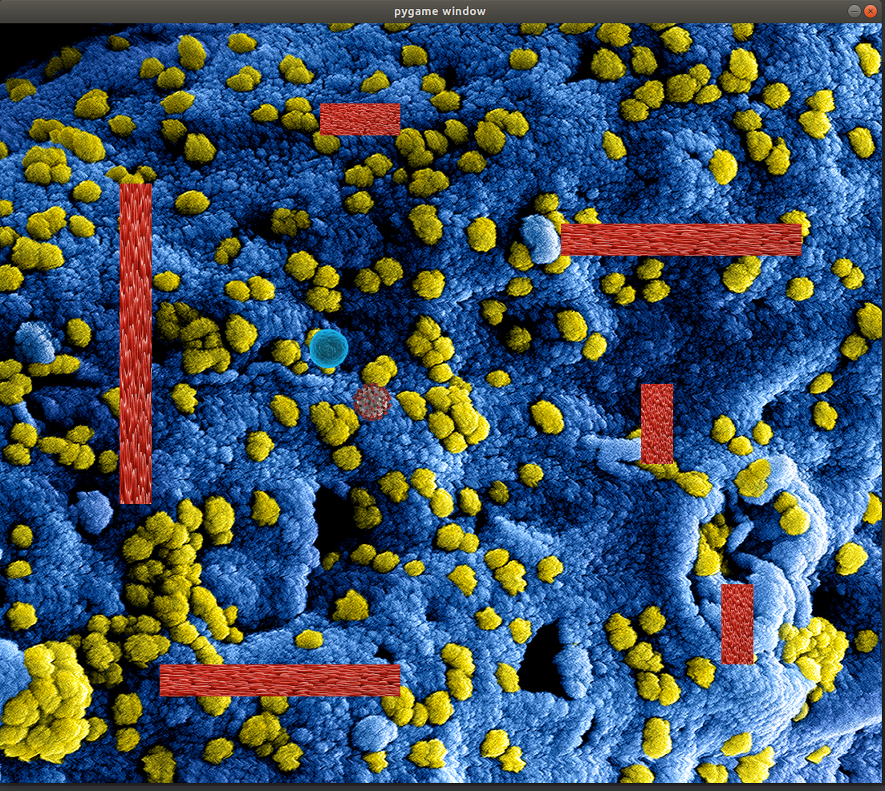

# Repozytorium
Gra zręcznościowa w której sterujemy obiektem po planszy podobnej do planszy pacmana. W losowych miejscach będą pojawiać się punkty do zebrania. Użytkownik ma na to ograniczony czas i wraz z zwiększaniem się ilości punktów maleje czas na zebranie przedmiotów.Sterowanie będzie odbywać się za pomocą strzałek bądź WASD.
Technologia użyta do tego projektu to Python wraz z biblioteką pygame.

# Raport I
Do tej pory utworzyłem okno gry , dodałem tło oraz postać. Postać ma możliwość poruszania się oraz kolizję z krawędziami okna ( np.gdy przekroczy lewą krawędź pokazuje się po prawej stronie).
Do następnego raportu planuję zrobić przeszkody w formie ścian oraz obiekt który będziemy zbierać.

Wygląd okna gry:

# Raport II
Do tej pory utworzyłem przeszkody w formie ścian oraz obiekt. Wprowadziłem interakcję między graczem , ścianą oraz obiektem. Podczas gdy gracz zbierze cel ten zmienia swoje położenie( Możliwość pojawiania się w przeszkodach została wyeliminowana), a gdy zderzy się z przeszkodą zostaje pokazany komunikat z napisem ''Koniec'' i po 2 sekundach gra rozpoczyna się od początku.
Do następnego raportu mam zamiar stworzyć menu w którym wstępnie będzie możliwość wyboru poziomu trudności i muzyki, która będzie puszczana w tle oraz punktację zdobytych punktów.

Wygląd okna gry:

# Raport III
Do tej pory utowrzyłem menu ,a w nim możliwość wyboru poziomu trudności (łatwy , średni ,trudny). W każdym kolejnym zostaje zwiększona liczba przeszkód oraz szybkość poruszania. Dodałem takż możliwość wyboru piosenek ,które będą grały w tle oraz zoptymalizowałem kod pod względem funkcji warunkowych odpowiedzialnych za kolizje. Do następnego raportu mam zamiar stworzyć licznik ,który będzie informował gracza ile pozostału mu czasu na zebranie celu ,dodanie ekeftów dzwiękowych gdy gracz wejdzie w interakcje z celem bądź ścianą oraz licznik życia. 

Wygląd okna gry:

